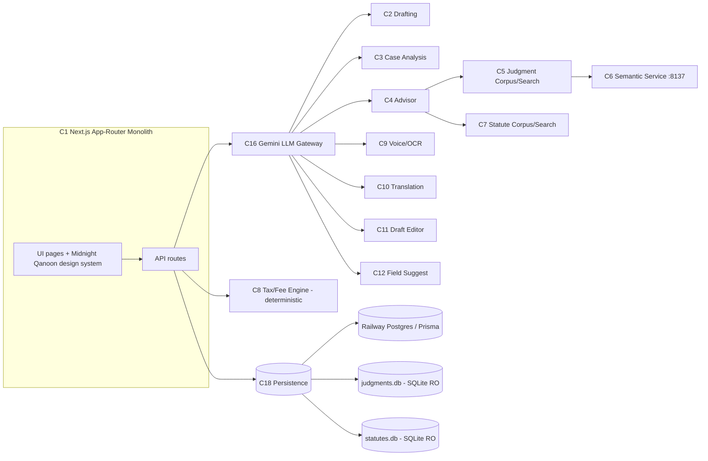

# TaqiAI — Architecture

- Status: `locked`
- Last updated: 2026-07-02
- Source PRD: `prd.md` (`locked`)
- Personalization gate: see `personalization-gate.md` → Architecture

## System overview

TaqiAI is a **Next.js 16 App-Router monolith** (React 19 + TypeScript) that serves both the UI and the API routes. AI generation runs through a single **Gemini LLM gateway** with a model fallback chain. Legal knowledge is served from three data planes: **Railway Postgres via Prisma** for user/app data (users, documents, matters, diary, chat), and two **read-only SQLite reference corpora** (judgments, statutes) queried at runtime for retrieval-augmented grounding. A separate **Python semantic-search service** (port 8137, fastembed) provides meaning-based judgment search with transparent fallback to keyword FTS. Deterministic work (tax/fees) runs in a rules engine that never touches the LLM.

## Components

| ID | Component | Responsibility | Satisfies (PRD reqs) | Build / Buy | ADR? |
|----|-----------|----------------|----------------------|-------------|------|
| C1 | Next.js App-Router Web App | UI + API monolith; ~48 routes; SSR/CSR | all | Build | ADR-1 |
| C2 | Drafting Engine | Template-based generation (`generate`, `smart-draft`, `draft-generator.ts`, `document-suggestions.ts`) across 12+ categories | R1.1, R1.2 | Build | — |
| C3 | Case Analysis Service | Decompose matter → structured case + `draftRequest` (`case-analysis`, `case-prepare`) | R2.1, R7.2 | Build | — |
| C4 | AI Advisor Service | Grounded chat (`advisor`, `intent-detection.ts`, `intent-handlers.ts`) + chat sessions | R3.1, R3.2 | Build | — |
| C5 | Judgment Corpus & Search | 100K+ judgments; keyword FTS, citation lookup, verify, citation graph (`judgment-db.ts`, `judgment-retrieval.ts`, `judgments/*`) | R4.1, R4.3 | Build | ADR-4 |
| C6 | Semantic Search Service | Python fastembed server on :8137; nearest-neighbour + `/reload`; keyword fallback | R4.2 | Build | ADR-4 |
| C7 | Statute Corpus & Search | Federal + 4 provincial Acts; FTS section lookup + grounding (`statute-db.ts`, `statute-retrieval.ts`, `statutes/search`) | R5.1 | Build | ADR-4 |
| C8 | Tax & Fee Engine | Deterministic per-province charges (`stamp-duty-reference.ts`, `property-transfer/tax-calculator`) — no LLM | R6.1 | Build | — |
| C9 | Voice & OCR Intake | Transcription (`voice`, `voice-transcribe`) + strict OCR (`extract-document`) | R7.1, R8.1 | Build | — |
| C10 | Translation Service | Urdu/English/Arabic free + structured + edit (`translate`, `translate-template`, `translate-edit`) | R9.1 | Build | — |
| C11 | Draft Editor Service | Surgical HTML-in → HTML-out edit (`edit-document`) | R10.1 | Build | — |
| C12 | Field Suggestion Service | Field-level drafting hints (`suggest`) | R11.1 | Build | — |
| C13 | Case/Matter/Diary Management | Matters, cases, diary, hearings CRUD (`matters/*`, `cases/*`, `diary/*`) | R12.1, R12.2 | Build | — |
| C14 | Document Vault | Save/retrieve/export documents (`documents/*`, html2pdf) | R1.2, R12.1 | Build | — |
| C15 | Auth & Accounts | JWT (jose) + bcrypt; middleware; profile (`auth/*`, `middleware.ts`, `auth.ts`) | all (gate) | Build | ADR-5 |
| C16 | Gemini LLM Gateway | Single generation gateway w/ model fallback chain (`gemini.ts`, `gemini-helper.ts`) | R1.x, R2.1, R3.1, R8.1, R9.1, R10.1, R11.1 | Buy (API) | ADR-2 |
| C17 | AI Trust / Confidence Layer | Standard response envelope + confidence dimensions + UI indicators (target state) | R13.1, R13.2 | Build | ADR-7 |
| C18 | Persistence Layer | Railway Postgres via Prisma (app data) + read-only SQLite reference DBs (runtime switch: `*-db-runtime.ts`) | R4.1, R5.1, R12.x, R1.2 | Build/Buy | ADR-3 |
| C19 | Design System (Midnight Qanoon) | Tokens in `globals.css`; shared `Sidebar`/`Topbar`/`ui/*`; RTL/Urdu; a11y | all UI | Build | — |

## Data models

> App data (Postgres via Prisma). Reference corpora (judgments/statutes) are read-only SQLite, rebuilt by scrapers — additive, reversible by swapping the DB file.

| Entity | Key fields | Owned by component | Migration / rollback | Notes |
|--------|-----------|--------------------|----------------------|-------|
| User | name, email, passwordHash, barCouncilId, phone, city, language | C15 | Prisma `db push` (additive); rollback = revert schema, restore backup | Replaces earlier JSON-user-db |
| Document | userId, title, category, subType, language, status, formData(JSON), generatedContent(HTML), deletedAt | C14 | Additive; soft-delete via `deletedAt` (reversible) | Confidence fields to be added (C17) |
| ChatSession / ChatMessage | userId, title / sessionId, role, content | C4 | Additive | Advisor history |
| Matter / MatterHearing | userId, caseNo, court, caseType, role, clientName/Cnic/Phone, opponentName, judgeName, dateFiled, nextHearing, documentIds(JSON), archived / date, purpose, result, nextDate | C13 | Additive; `archived` flag not hard delete | Canonical case model (Chamber) |
| LegalCase / CaseHearing | userId, courtName, nextHearingDate, clientName/Cnic/Phone, documentIds | C13 | **Retired/redirected** to Matter — read path only | Legacy; do not extend |
| DiaryEntry | userId, caseNumber, court, stage, proceeding, lastDate, nextDate, clientPhone | C13 | Additive | Dashboard cause list |
| SavedJudgment | userId, citation, title, court, year, summary, content, tags | C5 | Additive | User bookmarks |
| LegalJudgment / LegalJudgmentTag | citation(key), court, year, content, lawCategory, caseType, courtLevel, province, reportedStatus, reliability, taggingConfidence / tagType, tagValue, confidence, evidenceText | C5 | Reference corpus (SQLite RO); rebuild = swap file | 100K+; classified by area/type |
| LegalCitedCount / LegalCitationEdge | citedKey, n / citingId, citedKey | C5 | Reference corpus | Citation graph & cited-by ranking |
| LegalAct / LegalSection | actName, actYear, province, docType, status, fullText, sectionCount / actId, sectionNo, title, body | C7 | Reference corpus (FTS5); rebuild = re-run scraper + `build_statute_fts` | Federal + 4 provinces |
| LegalMigrationMeta | key, value, updatedAt | C7/C18 | Additive | Corpus build-state markers |

## Integrations & contracts

| Integration | Direction | Component | Contract / API | Failure handling |
|-------------|-----------|-----------|----------------|------------------|
| Google Gemini API | out | C16 | `@google/generative-ai` v0.24.1; models 2.5-flash → 2.5-flash-lite → 1.5-flash → 2.0-flash → lite | Model fallback chain; user-safe error normalisation (target); rate limit 20/min/user |
| Semantic service | out (internal HTTP) | C5 → C6 | `GET /search?q=&k=`, `GET /health`, `POST /reload` on :8137 | Transparent fallback to keyword FTS on any failure |
| Railway Postgres | out | C18 | `DATABASE_URL`; Prisma v6.19.3 | Connection retry; deploy runs `prisma db push` |
| SQLite reference DBs | in-process (RO) | C18 | `node:sqlite`; FTS5 | Read-only; missing DB → degrade feature, log |
| html2pdf export | client | C14 | in-browser PDF generation | Retry; fallback to print |

## Binding standards (best-practice defaults — applied, not gated, but BINDING on every segment)

> The single definition every segment builds against. At handoff this seeds Forgeflow's `_shared-canon.md`.

| Concern | Standard (the one definition) |
|---------|-------------------------------|
| Error format | AI/API routes return JSON `{ error, code }`; internal/provider details logged server-side only, never leaked to the client (see ADR-7 / Phase 5). Target AI envelope: `{ data, confidence, verification_status, evidence, model_version }` |
| API conventions | Next.js App-Router route handlers under `/api/**`; REST-ish (`GET` list, `POST` create, `PUT` update, `DELETE`); JSON bodies; `[id]` dynamic segments |
| Auth / authz model | JWT (jose) in cookie; `middleware.ts` guards non-public routes; every AI route calls auth + `rateLimit()` before doing work; user-scoped queries by `userId` |
| Input validation | Zod v4 schemas on route inputs (target: consistent across all AI routes); max text length on prompts; file type/size checks on uploads; HTML sanitised with dompurify before render |
| Naming / structure | `src/app/**` routes; `src/lib/**` services; `src/components/{layout,ui}/**`; runtime DB switch via `*-db-runtime.ts` |
| Observability | Structured server-side logs for AI calls, auth failures, rate-limit hits, search failures; healthcheck endpoint (target, Phase 5) |

## Non-functional targets (quantified — hard-gate candidates)

| NFR | Target (measurable) | Applies to |
|-----|---------------------|-----------|
| Performance | Keyword judgment/statute search p95 < 1s; AI generation streamed where possible | C5, C7, C2, C4 |
| Accuracy | Citation accuracy > 90%; hallucination < 10%; structural compliance 100%; 0 invented sections | C2, C4, C5, C7, C17 |
| Security posture | Auth required on all non-public routes; **no default/fallback JWT secret** (fail fast if missing); secrets never logged | C15, all |
| Reliability | Graceful degradation: semantic → keyword fallback; Gemini model fallback chain | C5, C6, C16 |
| Privacy / data | Client PII (CNIC, phone) user-scoped; PDPB alignment; no PII in logs | C13, C14, C18 |
| Accessibility | WCAG 2.1 AA; reduced-motion support; RTL/Urdu correctness | C19 |
| Rate limiting | Persistent (cross-instance) limiter in production; per-user + per-IP; stricter on OCR/voice/judgment/generate | C15, C16 |

## Testing standard (levels segments inherit)

- **Unit** — deterministic logic (tax engine C8, formatting `pk-format.ts`, retrieval selectors) must have unit tests covering rate/base correctness and edge inputs.
- **Integration** — API routes tested against a test Postgres + fixture SQLite corpora; auth + rate-limit paths exercised; invalid-payload (zod) cases.
- **E2E** — critical journeys: draft→export, advisor grounded answer, judgment search + fallback, tax calculation, matter+hearing lifecycle.
- **Accuracy/QA (module-specific)** — validation runs + scorecards (C17): drafting structure/sections/missing-fields; advisor grounding/citation/refusal; OCR exact extraction; voice transcript quality; judgment citation precision/recall.
- **Verify command shape:** `npm run build` + targeted route/integration checks; scorecard runs recorded in `testing/`.

## Architecture Decision Records (flags)

| ADR | Decision | Options | Recommended default + reason | Status |
|-----|----------|---------|------------------------------|--------|
| ADR-1 | App architecture | Next.js App-Router monolith / split FE+BE / microservices | **Monolith** — one team, one deploy, shared types; fastest to ship & maintain | Decided |
| ADR-2 | LLM provider strategy | Direct Gemini + fallback chain / multi-provider abstraction / self-host | **Direct Gemini with model fallback** — cost/quality fit; abstraction deferred | Decided |
| ADR-3 | App DB | SQLite / Postgres on Railway | **Postgres via Prisma** for app data; SQLite kept read-only for reference corpora | Decided (migration complete) |
| ADR-4 | Legal corpus storage & search | All-Postgres / SQLite RO + Python embeddings / external search svc | **SQLite RO corpora + Python semantic service w/ keyword fallback** — free, portable, degrades gracefully | Decided |
| ADR-5 | Auth/session model | JWT (jose) / session store / third-party auth | **JWT now**; revisit managed auth later; **remove fallback secret** (Phase 5) | Decided, hardening open |
| ADR-6 | Deployment & region | Railway / other PaaS | **Railway** (`prisma db push` on deploy); data-region/PDPB policy to finalise | Decided, policy open |
| ADR-7 | AI confidence contract | none / per-route ad hoc / standard envelope + confidence schema | **Standard response envelope + confidence dimensions + UI indicators** | Open — Phase 5 |

## Coverage check (PRD ↔ Architecture)

| PRD requirement | Component(s) satisfying it |
|-----------------|----------------------------|
| R1.1, R1.2 | C2, C14, C16, C19 |
| R2.1 | C3, C16 |
| R3.1, R3.2 | C4, C5, C7, C16, C18 |
| R4.1, R4.3 | C5, C18 |
| R4.2 | C5, C6 |
| R5.1 | C7, C18 |
| R6.1 | C8 |
| R7.1, R7.2 | C9, C3, C16 |
| R8.1 | C9, C16 |
| R9.1 | C10, C16 |
| R10.1 | C11, C16 |
| R11.1 | C12, C16 |
| R12.1, R12.2 | C13, C14, C18 |
| R13.1, R13.2 | C17 |
| (cross-cutting) | C1, C15, C18, C19 |

## Validation gate (before `locked`)

- [x] Every PRD requirement is satisfied by ≥1 component; every component traces to ≥1 requirement.
- [x] ADR flags raised for every genuinely open architectural choice; defaults stated.
- [x] Binding standards stated as actual conventions (error format, API, auth/authz, validation, naming).
- [x] NFR targets quantified (measurable values), not gestured.
- [x] Testing standard states which levels apply and what each must cover.
- [x] Migration / rollback noted for every entity that changes existing data.
- [x] Personalization gate recorded in `personalization-gate.md`.
- [x] `blueprint-progress.md` shows Architecture = `locked`; `next-steps-handoff.md` points to Phases.
